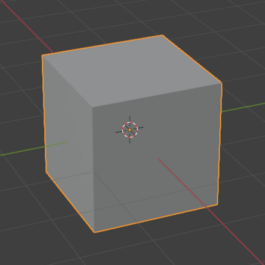
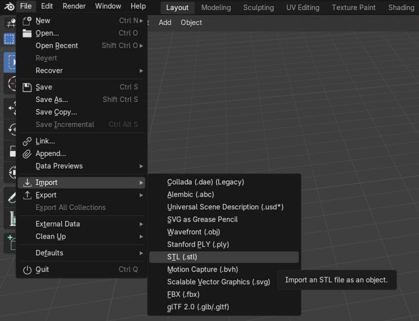
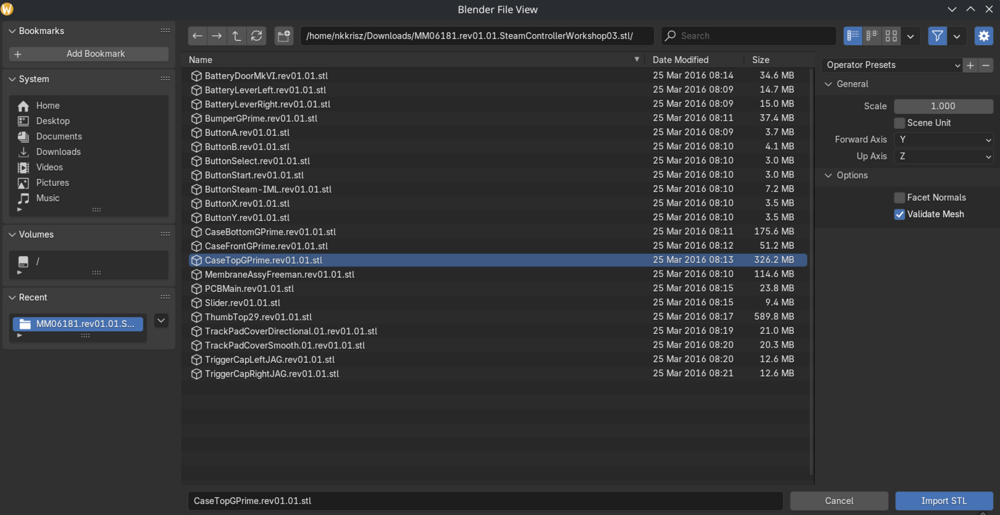
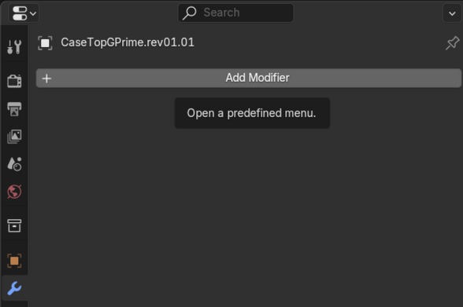
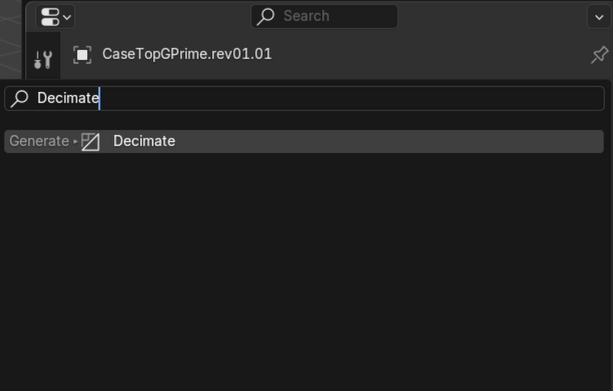
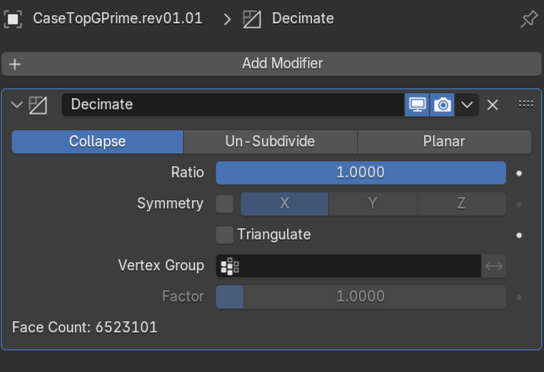
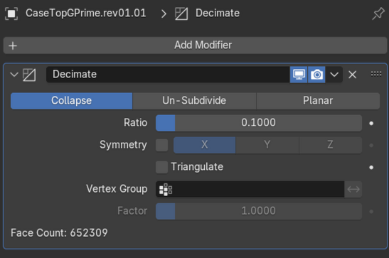
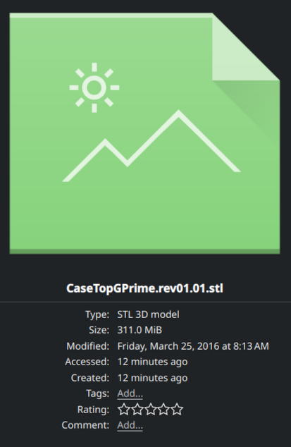
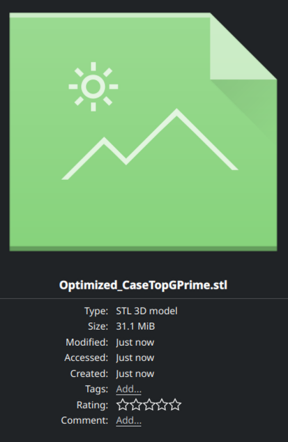

# 3D Printing Parts For The Steam Controller

## CAD Files / Models
- [Official CAD Release](https://store.steampowered.com/news/app/353370/view/3931035846865618326)
- [Additional 3rd Party Models - Includes Missing Ones From The Official Release](https://github.com/MichaelZaugg/OpenSteamController-Continued/tree/master/Mods/CAD-Releases)

## Potential Issues & Solutions

### File size too large
1. [Download Blender (Available On Steam too)](https://www.blender.org/download/)

2. Select and delete default cube
    - 

3. Import model (File > Import > File Type > File Browser)
    - 
    - 

4. Add decimate modifier (Blue Wrench > Add Modifier > Search > Decimate)
    - 
    - 
    - 

5. Decrease ```Ratio``` value until acceptable quality loss / file size requirement (```Face Count``` should go down)
    - 

6. Select and export model (File > Export > File Type > File Browser)
    - 

7. The file size should be smaller
    - Before
        - 
    - After
        - 

### Slicer Issues
- Use [Blender](https://www.blender.org/), [FreeCAD](https://www.freecad.org/) or other alternatives to fix the errors pointed out in the models (hidden holes, structural flaws etc...)

### Preventing Parts From Breaking / Being Fragile
- Use a tougher material
- Increase rigidity by editing the models
    - Try making certain areas thicker

#### Additional Notes
- CAD users should use .step files for making changes