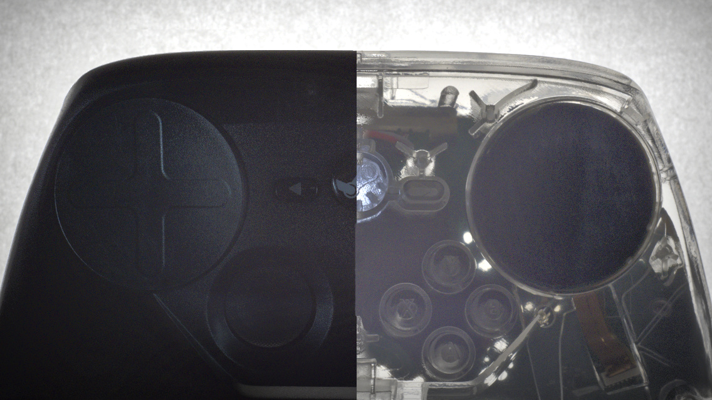
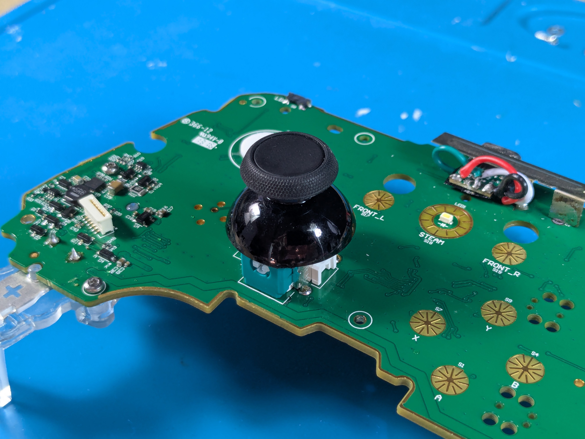
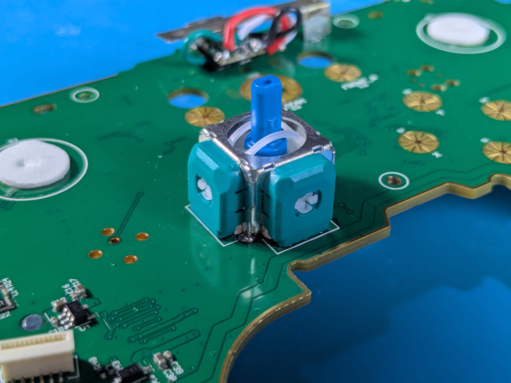
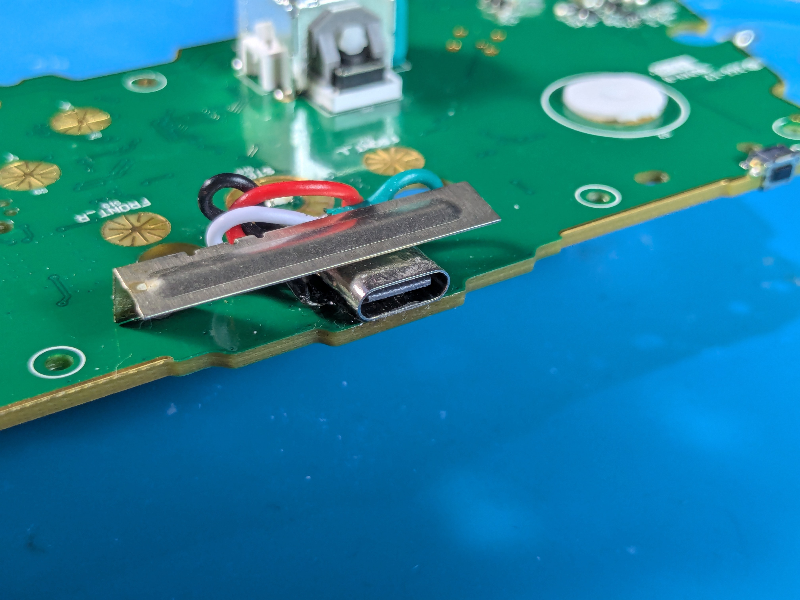
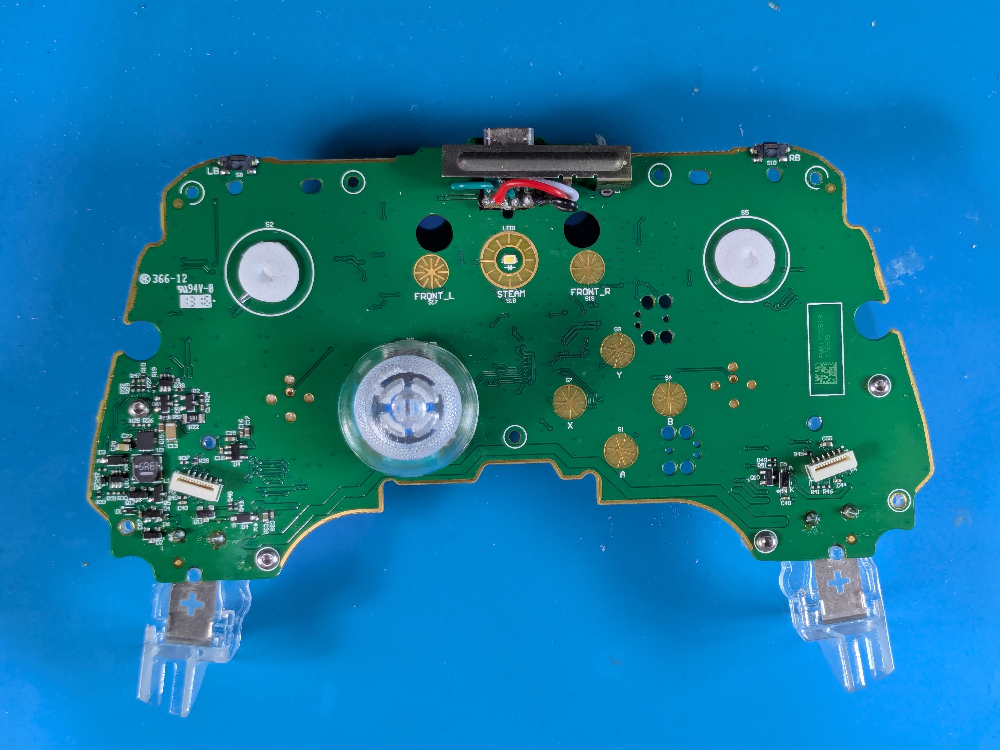
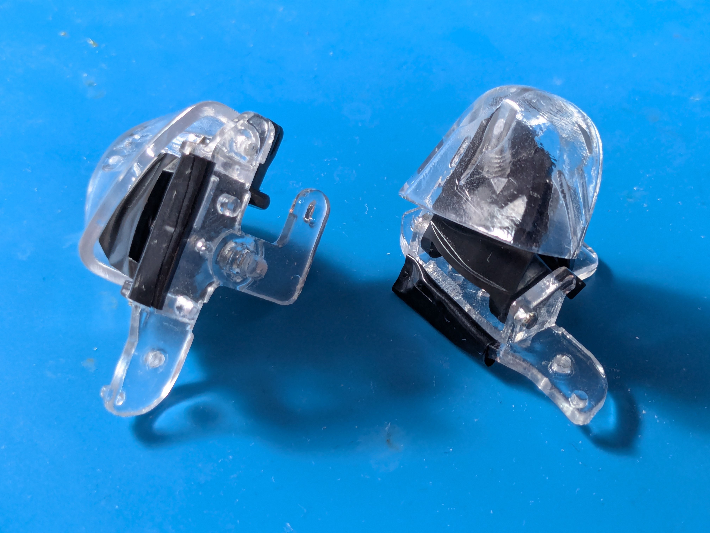
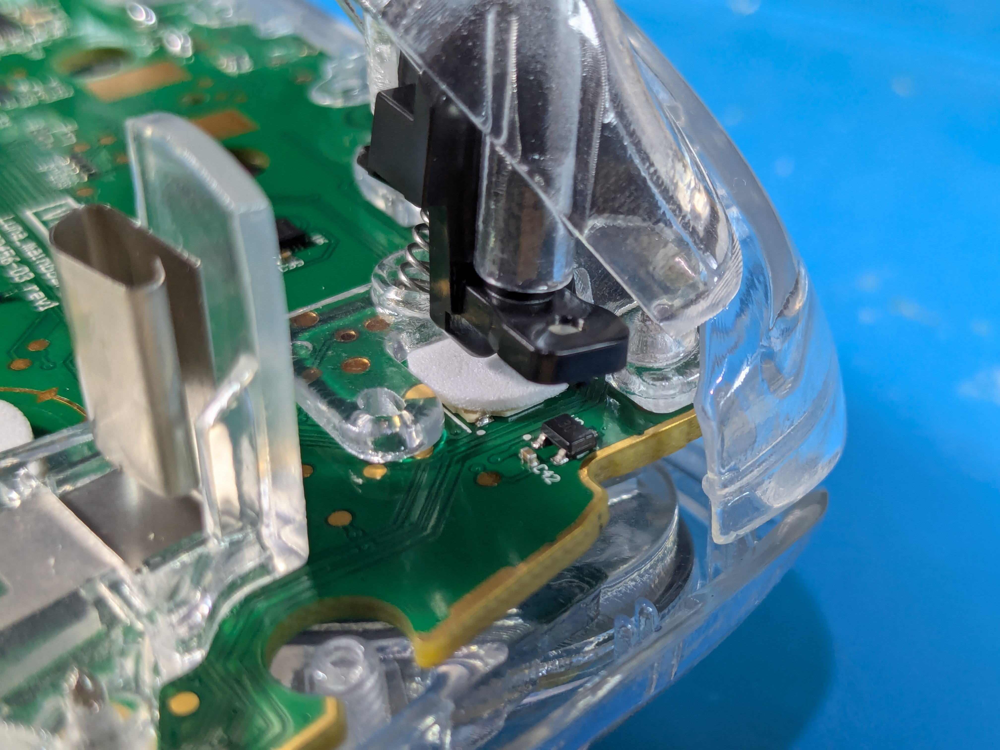
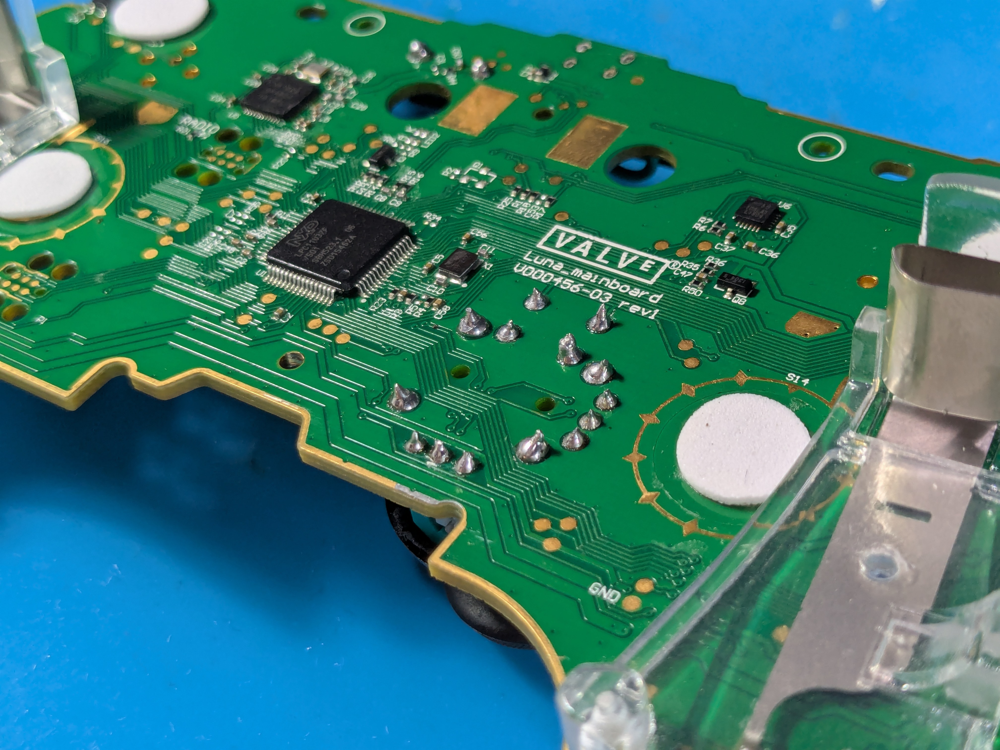

# Steam Controller Guide - Made by [NKkrisz](https://links.nkkrisz.com)
Information about Steam Controller:
- Firmware
- Hardware Modifications And Repairs

## Accompanying Video - the original steam controller.

- I first recommend fully watching this video before trying anything here
- Click the image to be redirected

## Sponsored By JLC3DP
- Thanks JLC3DP for sponsoring the previously mentioned video and making this project possible
- Check them out using the link below:
    - JLC3DP 3D Printing Starts at $0.3, up to $70 new user coupons: [https://jlc3dp.com/?from=NKkrisz](https://jlc3dp.com/?from=NKkrisz)

## Help Fund Future Projects By Donating
- You can support me through Ko-fi:

## Related Project - [Steam Deck Guide](https://steamdeck.guide)
- I've also made the [Steam Deck Guide](https://steamdeck.guide) which contains information and guides about the Steam Deck and available modifications.

## Disclaimer
- This project isn't associated with Valve and modifying your device may void your warranty.
- The guide is made for educational purposes and may contain mistakes, you're responsible for your own device.
- Reporting errors and submitting suggestions can be done through the [project's GitHub Issues page](https://github.com/NKkrisz/Steam-Controller-Guide/issues) or by [contacting me](https://links.nkkrisz.com).

## [Firmware](./Markdown/Firmware.md)
Information about different connection modes, updating firmware, Bluetooth support etc...

## Hardware
The controller is mostly easy to modify and repair with the right tools.

### [Teardown Guide](./Markdown/Teardown.md)

### [Soldering Guide](./Markdown/Soldering.md)

### [Reassembly Guide](./Markdown/Reassembly.md)

### [3D Printing Parts](./Markdown/3D_Printing_Parts.md)

### [Joystick Cap & Module](./Markdown/Joystick.md)

### [USB Port](./Markdown/USB_Port.md)

### Front Plate Buttons
- [Update on Steam Deck face button mod](https://www.reddit.com/r/SteamControllerMods/comments/1erquuf/update_on_steam_deck_face_button_mod/)

### Trackpads
- [Quieter & Softer Trackpad Mod For The Steam Controller](https://www.youtube.com/shorts/NYpm2bWQAME)
- [Steam Controller Mod - Softer Bumper & Touchpad Clicks](https://www.youtube.com/watch?v=nbiIVGCP4eQ)
- [Steam Controller Mod - Softer Trackpad Click Update](https://www.youtube.com/watch?v=0C_BOfGiAeg)

### Bumper Buttons
- [Quieter & Softer Bumper Mod For The Steam Controller](https://www.youtube.com/shorts/ARzfF4CxAJA)
- [Steam Controller Mod - Softer Bumper & Touchpad Clicks](https://www.youtube.com/watch?v=nbiIVGCP4eQ)

### Triggers

### Backplate
- [Life Hack! Softer Back Paddle Grip Clicks DIY Modification - Steam Controller Tutorial / Tip](https://www.youtube.com/watch?v=MRAnlI4amwk)
- [Backplate With USB Receiver Holder Models To 3D Print](https://store.steampowered.com/news/app/353370/view/3931035846865618326)

### Example: NKkrisz's Modded Steam Controller
- Transparent Parts (Shell, Buttons, Trackpads, Joystick etc...)
- Micro-USB To USB-C Swap
- TMR Joystick Module Upgrade
- Quieter, Softer Trackpads And Triggers (Foam And Tape)

## Additional Resources & Interesting Things
- [Steam Controller Mods & Accessories - Videos By RambleCan](https://www.youtube.com/playlist?list=PLMV7bfY2SzbVxrkXYfDa4SwcvdUSwohv8)
- [OpenSteamController-Continued](https://github.com/MichaelZaugg/OpenSteamController-Continued)
- [iFixit Guides And Teardowns](https://www.ifixit.com/Device/Steam_Controller)
- [r/SteamController](https://www.reddit.com/r/SteamController/)
- [r/SteamControllerMods](https://www.reddit.com/r/SteamControllerMods/)
- [Steam Controller Discord](https://discord.com/invite/BuANgkG)
- [3D Printable Models For The Steam Controller](https://www.yeggi.com/q/steam+controller/)
- [Steam Controller - General Discussions](https://steamcommunity.com/app/353370/discussions/)
- [Steam Controller - News Hub](https://store.steampowered.com/news/app/353370/)
- [Steam Controller - Store Page](https://store.steampowered.com/app/353370/Steam_Controller/)
- [Steam Controller - Wikipedia Page](https://en.wikipedia.org/wiki/Steam_Controller)
- [Steam Controller & Steam Link Box Scans](https://archive.org/details/steam-link-steam-controller-box-scans/)
    - [Box Art Inspired Renders](https://www.reddit.com/r/SteamControllerMods/comments/1lmvo7q/steam_controller_renderings_box_art_inspired_8k/)
- [Transparent Valve Hardware Team Exclusive Steam Controller](https://www.reddit.com/r/SteamController/comments/6lrg7g/just_realized_ive_never_shared_this_here/)
    - [Image of the backside by u/Plagman](http://imgur.com/a/7PORl)